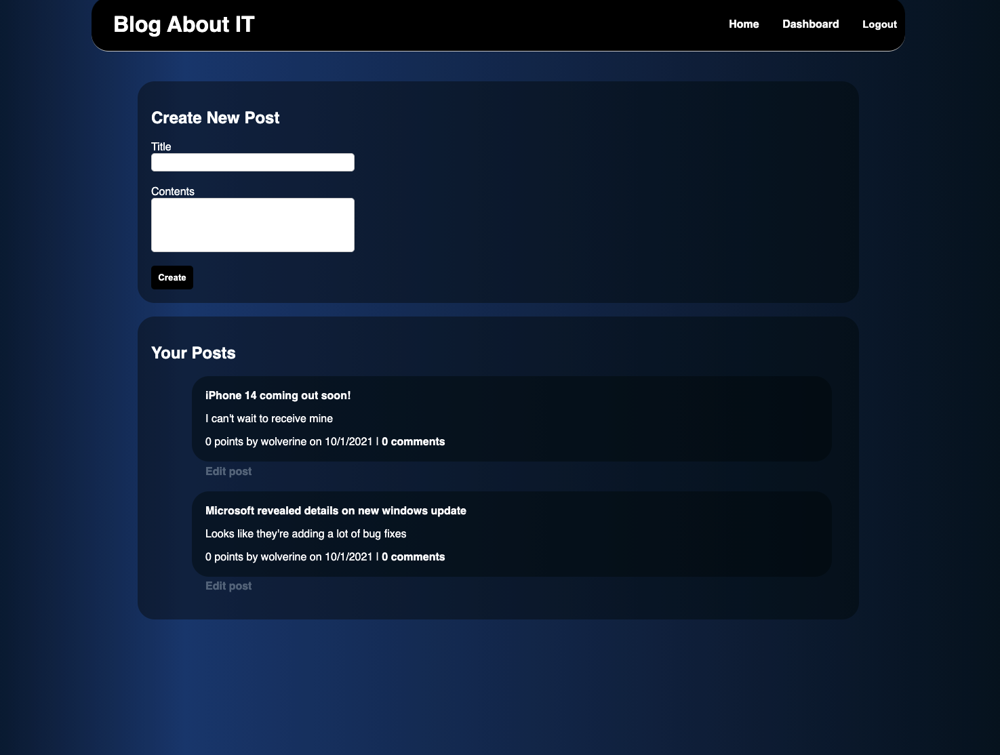

# blog-about-it
Creates a CMS style blog where users can share IT related content. Users are then able to upvote, comment on, or edit posts.

## Table of Contents
* [Installation](#installation)
* [License](#license)
* [Built With](#built-with)
* [Heroku](#heroku)
* [Questions](#questions)
* [Credits](#credits)

## Installation
Install necessary dependencies before use

## License
This application uses the MIT license.

## Built With
* Bcrypt
* Connect-session-sequelize
* Dotenv
* Express
* Express-handlebars
* Express-session
* Handlebars
* MySQL2
* Sequelize
* Nodemon

## Heroku

## Questions
Feel free to contact regarding any questions you may have. 
Github: https://github.com/wamackie 
Email: wamackie8456@gmail.com

## Credits
Employee Manager was created by William Mackie